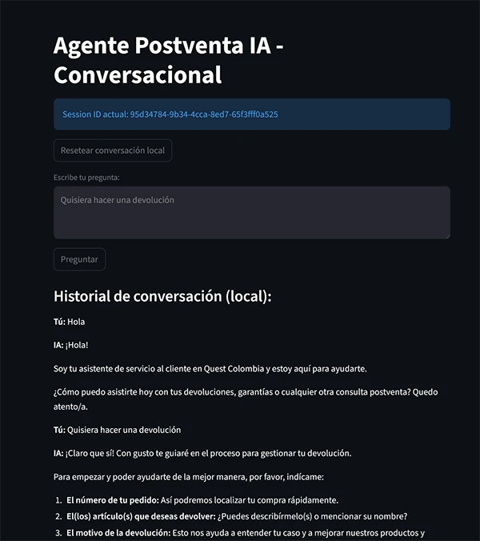

# AI Customer Service Agent with RAG

> A production-style conversational AI system that answers customer inquiries by retrieving and reasoning over company policy documents — built as a pilot demo for a Colombian fashion retailer.

---

## Motivation

Most LLM-based chatbots hallucinate when asked domain-specific questions because they rely solely on parametric knowledge baked into the model at training time. This project addresses that limitation using **Retrieval-Augmented Generation (RAG)**: rather than hoping the model "knows" the answer, the system fetches the relevant policy chunks at query time and grounds every response in verified company documentation.

The use case is post-sales customer support for a fashion retail company (Quest Colombia), covering returns, warranties, and general inquiries. The same architecture generalizes to any domain where accuracy and source fidelity matter.

---

## Skills Demonstrated

- **RAG pipeline design**: end-to-end implementation from document ingestion to grounded LLM response
- **LLM integration**: advanced prompt engineering with Google Gemini 2.5 Flash, including structured system prompts with response guidelines, tone control, and grounding enforcement
- **Vector search**: semantic retrieval with ChromaDB and Google embedding models
- **API development**: RESTful API design with FastAPI, including file upload, session management, and CORS
- **Conversational state management**: multi-turn session tracking with automatic expiry (SQLite-backed)
- **Frontend development**: interactive chat UI with real-time document upload via Streamlit
- **Data persistence**: dual-logging strategy (relational DB + structured log file) for auditability
- **Software architecture**: clean separation of concerns across services, API, models, and frontend layers

---

## Demo



---

## How It Works

The system implements a two-phase pipeline:

**Indexing phase** — run once when new documents are added:
```
Raw document (TXT / PDF)
    → Text extraction
    → Chunking (300-char chunks, 50-char overlap)
    → Embedding generation (Google embedding-001)
    → Storage in ChromaDB vector store
```

**Query phase** — runs on every user message:
```
User message
    → Query embedding + semantic search (top-5 relevant chunks)
    → Session history retrieval (SQLite)
    → Prompt construction: system role + retrieved context + conversation history + user query
    → Gemini 2.5 Flash generates a grounded response
    → Response logged (SQLite + JSONL) and returned to the user
```

This design means the LLM never needs to memorize company policies — it reads them at inference time, making the system easy to update without any retraining.

---

## Architecture Decisions

| Decision | Rationale |
|----------|-----------|
| **RAG over fine-tuning** | Policies change frequently; RAG allows updates by re-indexing a document rather than retraining a model. |
| **ChromaDB** | Lightweight, runs locally with no external cloud dependency, suitable for a pilot deployment with minimal infrastructure overhead. |
| **Google Gemini 2.5 Flash** | Strong instruction-following for constrained system prompts; fast and cost-effective for conversational use. |
| **FastAPI + Streamlit** | Decoupled frontend/backend allows the API to be consumed independently (e.g., by a mobile app or third-party integration). |
| **SQLite for session history** | Zero-infrastructure persistence; conversation turns are structured and queryable without a separate database server. |
| **Dual logging (SQLite + JSONL)** | SQLite enables relational queries on history; JSONL is portable and easy to ship to external log aggregators. |
| **Chunk size 300 / overlap 50** | Balances retrieval precision (small chunks = more specific matches) against context completeness (overlap prevents cutting mid-sentence). |

---

## Tech Stack

| Layer | Technology |
|-------|-----------|
| LLM | Google Gemini 2.5 Flash |
| Embeddings | Google Generative AI (`models/embedding-001`) |
| Vector DB | ChromaDB (HTTP client mode) |
| Backend | FastAPI + Uvicorn |
| Frontend | Streamlit |
| Database | SQLite (conversation history) |
| ORM | SQLAlchemy |
| Text Processing | LangChain text splitters, PyMuPDF |
| Observability | OpenTelemetry (OTLP) |

---

## Project Structure

```
customer_service_RAG/
├── app/
│   ├── api/
│   │   └── main.py             # FastAPI REST endpoints + session management
│   ├── frontend/
│   │   └── frontend.py         # Streamlit chat UI with file upload
│   ├── models/
│   │   └── models.py           # SQLAlchemy ORM models (conversation history)
│   └── services/
│       ├── rag_service.py      # Custom RAG pipeline: chunking, embedding, retrieval
│       └── gemini_service.py   # Prompt engineering + Gemini API calls
├── data/
│   └── policies/
│       ├── politicas.txt              # Returns, exchanges, warranties (comprehensive)
│       ├── envios.txt                 # Shipping and delivery policies
│       ├── pagos.txt                  # Payment methods and refunds
│       ├── como_comprar.txt           # Shopping process guide
│       ├── contacto_y_soporte.txt     # Customer service contact info
│       └── preguntas_frecuentes.txt   # Frequently asked questions
├── scripts/
│   ├── indexar.py              # Bulk-index documents into ChromaDB
│   └── limpiar_chroma.py       # Reset vector store (Windows-safe)
├── tests/
│   ├── test_rag.py             # RAG retrieval integration tests
│   └── test_embedding.py       # Embedding model connectivity tests
├── storage/
│   ├── logs/
│   │   └── interacciones.jsonl # Structured interaction log
│   └── historial.db            # SQLite conversation history
├── chroma/                     # ChromaDB persistent storage
├── requirements.txt
└── .env                        # API keys (not committed)
```

---

## Prerequisites

- Python 3.10+
- A running ChromaDB server on `localhost:8001`
- A Google API key with access to Generative AI APIs

---

## Setup

1. **Clone the repository**

   ```bash
   git clone <repo-url>
   cd customer_service_RAG
   ```

2. **Create and activate a virtual environment**

   ```bash
   python -m venv venv
   # Windows
   venv\Scripts\activate
   # macOS/Linux
   source venv/bin/activate
   ```

3. **Install dependencies**

   ```bash
   pip install -r requirements.txt
   ```

4. **Configure environment variables**

   Create a `.env` file in the project root:

   ```env
   GOOGLE_API_KEY=your_google_api_key_here
   ```

5. **Start ChromaDB**

   ```bash
   chroma run --host localhost --port 8001 --path ./chroma
   ```

6. **Index company policies**

   ```bash
   python scripts/indexar.py
   ```

---

## Running the Application

Start the backend and frontend in separate terminals.

**Backend (FastAPI)**

```bash
uvicorn app.api.main:app --host 0.0.0.0 --port 8000 --reload
```

**Frontend (Streamlit)**

```bash
streamlit run app/frontend/frontend.py
```

Open `http://localhost:8501` in your browser.

---

## API Endpoints

| Method | Endpoint | Description |
|--------|----------|-------------|
| `POST` | `/subir-y-indexar` | Upload and index a single TXT or PDF file |
| `POST` | `/subir-multiples` | Upload and index multiple TXT or PDF files |
| `POST` | `/preguntar` | Single-turn Q&A (stateless) |
| `POST` | `/preguntar-conversacional` | Multi-turn Q&A with session management |
| `GET` | `/historial/{session_id}` | Retrieve full conversation history for a session |

---

## Key Features

- **Multi-turn conversations**: session-based chat with full history, auto-expired after 2 hours of inactivity
- **Grounded responses**: every answer is backed by retrieved document chunks, not model memorization
- **Document ingestion at runtime**: upload new TXT or PDF files through the UI without restarting the server
- **Scope enforcement**: system prompt restricts the agent strictly to post-sales topics
- **Dual logging**: SQLite for queryable history, JSONL for portable structured logs
- **Decoupled architecture**: API and frontend are independent — the API can serve any client

---

## Utility Scripts

| Script | Description |
|--------|-------------|
| `scripts/indexar.py` | Index all policy documents from `data/policies/` into ChromaDB |
| `scripts/limpiar_chroma.py` | Delete local ChromaDB storage (Windows-safe) |

---

## Testing & Evaluation

This project includes an evaluation suite that demonstrates RAG-specific testing methodologies. The test suite uses a hybrid approach combining deterministic metrics and LLM-as-judge evaluation.

### Test Architecture

```
tests/
├── fixtures/
│   └── eval_dataset.json           # 30 curated test cases
├── evaluators/
│   ├── llm_judge.py                # LLM-as-judge evaluators
│   └── retrieval_metrics.py        # Deterministic retrieval metrics
├── conftest.py                     # Pytest fixtures and configuration
├── test_retrieval_quality.py       # Hit rate, MRR, Precision@k
├── test_answer_faithfulness.py     # Hallucination detection
├── test_answer_correctness.py      # Factual accuracy
├── test_scope_enforcement.py       # In/out-of-scope handling
├── test_response_quality.py        # Tone, style, completeness
├── test_conversational_coherence.py # Multi-turn context awareness
└── run_full_eval_suite.py          # Master evaluation runner
```

### Evaluation Metrics

| Category | Metrics | Method | Threshold |
|----------|---------|--------|-----------|
| **Retrieval Quality** | Hit Rate, MRR, Precision@k | Deterministic | ≥85%, ≥70%, ≥40% |
| **Answer Faithfulness** | Hallucination rate | LLM Judge | ≤5% |
| **Answer Correctness** | Semantic accuracy | LLM Judge | ≥85% |
| **Scope Enforcement** | Proper handling rate | LLM Judge | 100% |
| **Response Quality** | Tone, completeness | LLM Judge | ≥80%, ≥85% |
| **Conversational** | Context awareness | LLM Judge | ≥90% |

### Running Tests

**Install test dependencies:**
```bash
pip install -r requirements.txt
```

**Run full evaluation suite:**
```bash
# Standard mode (balanced)
python tests/run_full_eval_suite.py

# Quick mode (skip slow tests)
python tests/run_full_eval_suite.py --quick

# Full mode (all tests)
python tests/run_full_eval_suite.py --full
```

**Run individual test categories:**
```bash
# Retrieval quality (fast, deterministic)
pytest tests/test_retrieval_quality.py -v

# Answer faithfulness (LLM judge)
pytest tests/test_answer_faithfulness.py -v

# Answer correctness (LLM judge)
pytest tests/test_answer_correctness.py -v

# Scope enforcement
pytest tests/test_scope_enforcement.py -v

# Response quality
pytest tests/test_response_quality.py -v

# Conversational coherence
pytest tests/test_conversational_coherence.py -v

# Skip slow tests
pytest tests/ -m "not slow" -v
```

### Test Results

After running tests, results are saved to `eval_results/`:
- `report.html` - Interactive HTML report with detailed test results
- `eval_summary_[timestamp].md` - Markdown summary with methodology
- `retrieval_metrics_[timestamp].json` - Detailed retrieval metrics

### Judge LLM Configuration

The evaluation uses an LLM judge for semantic evaluation. Configure via environment variable:

```bash
# Default (included in .env)
JUDGE_LLM=gemini-2.5-flash

# For production evaluations (optional)
JUDGE_LLM=gemini-2.0-pro
```

### Why This Testing Approach?

**Hybrid Strategy:**
- **Deterministic tests** for retrieval (vector search is deterministic)
- **LLM-as-judge** for semantic evaluation (handles paraphrasing, tone, context)

**RAG-Specific Metrics:**
- **Retrieval quality** - Test vector search separately from generation
- **Faithfulness** - Critical for RAG (no hallucinations)
- **Correctness** - Semantic accuracy vs ground truth
- **Scope enforcement** - Customer service boundary detection
- **Quality** - Tone, empathy, professionalism
- **Conversational** - Multi-turn context maintenance

**Production-Ready:**
- 30+ test cases across 6 policy topics
- Multiple difficulty levels (easy, medium, hard)
- Edge cases and adversarial prompts
- Topic and difficulty breakdowns
- Comprehensive reporting

---

## Environment Variables

| Variable | Description |
|----------|-------------|
| `GOOGLE_API_KEY` | Google Generative AI API key |
| `JUDGE_LLM` | LLM model for evaluation (defaults to gemini-2.5-flash) |